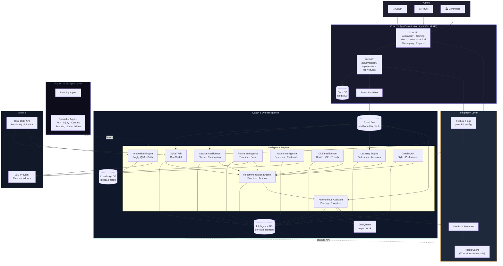

# Coach's Eye Intelligence — Production Architecture

**Version:** 1.0  
**Date:** 2026-06-10  
**Status:** Architecture Definition — Pre-Implementation  
**Scope:** Coach's Eye Intelligence (AI Brain) — service design for scale

---

## Table of Contents

1. [Executive Summary](#1-executive-summary)
2. [Architecture Principles](#2-architecture-principles)
3. [System Overview](#3-system-overview)
4. [Core vs Intelligence Boundary](#4-core-vs-intelligence-boundary)
5. [Engine Specifications](#5-engine-specifications)
6. [Event Flow Architecture](#6-event-flow-architecture)
7. [Data Ownership](#7-data-ownership)
8. [API Boundaries](#8-api-boundaries)
9. [Multi-Tenancy Design](#9-multi-tenancy-design)
10. [Architecture Diagram](#10-architecture-diagram)
11. [Recommended Folder Structure](#11-recommended-folder-structure)
12. [Five-Year Roadmap](#12-five-year-roadmap)

---

## 1. Executive Summary

Coach's Eye Intelligence is a purpose-built AI layer that sits above Coach's Eye Core. It exists to make coaches smarter, not to replace Core's workflow.

**Core owns the UX. Intelligence owns the thinking.**

Core must remain fully functional if Intelligence is completely offline. Every AI-generated insight is an enhancement — never a dependency. Intelligence reads from Core's data, runs its models, and delivers results back through a narrow, versioned API. Core never embeds AI logic.

At scale, Intelligence will serve thousands of clubs across different sports, leagues, and countries. Its architecture must support:

- Per-club personalisation from day one
- Shared learning across clubs without leaking private data
- Asynchronous processing so AI latency never blocks the UI
- Cold-start operation for new clubs with no history
- Cost control at thousands of clubs (not every club needs every engine every day)

---

## 2. Architecture Principles

### P1 — Offline-safe Core
Every Intelligence response has a defined fallback. If the entire Intelligence layer returns 503, Core shows its own data without any error state visible to the user. Intelligence is a premium enhancement, not infrastructure.

### P2 — Single direction of data flow
```
Core → Intelligence (data read, event push)
Intelligence → Core (results delivered via API pull or webhook)
Core never calls Intelligence synchronously on the hot path.
```

### P3 — Engine isolation
Each Intelligence engine owns its own data store, its own compute schedule, and its own API surface. Engines communicate through a shared event bus, not direct function calls. No engine imports another engine's internal modules.

### P4 — Club data sovereignty
A club's data never trains models shared across other clubs without explicit consent and anonymisation. The shared learning layer operates only on statistical aggregates, never raw club records.

### P5 — Async by default
Heavy computation (Digital Twin rebuild, prediction runs, recommendation generation) is always asynchronous. The API returns a job reference immediately; the client polls or receives a webhook when results are ready.

### P6 — Versioned contracts
Every Intelligence API endpoint is versioned. Core specifies the API version it targets. Breaking changes require a new version — old versions are supported for at least 90 days.

### P7 — Feature flags, not code branches
Intelligence features are enabled per-club via feature flags stored in Core's configuration. The AI Brain reads these flags before spending compute. A flag being off means zero AI cost for that club.

### P8 — Cost awareness
Every engine logs its LLM token consumption per club per day. Budget limits can be set per club tier. Engines degrade gracefully (template responses, cached results) when budgets are exceeded.

---

## 3. System Overview

```
┌─────────────────────────────────────────────────────────────────┐
│                        CLUBS (end users)                        │
│              Coaches · Players · Committee · Parents            │
└──────────────────────────┬──────────────────────────────────────┘
                           │
┌──────────────────────────▼──────────────────────────────────────┐
│                    COACH'S EYE CORE                             │
│   Availability · Training · Match Centre · Squad · Medical     │
│   Messaging · Reports · Notifications · Auth · Billing         │
│                                                                 │
│   Exposes: Club Events · Data Read API · Feature Flags         │
│   Consumes: Intelligence Results API (optional, async)         │
└──────────────────────────┬──────────────────────────────────────┘
                           │  Event Bus + Results API
┌──────────────────────────▼──────────────────────────────────────┐
│                 COACH'S EYE INTELLIGENCE                        │
│                                                                 │
│  ┌─────────────┐  ┌──────────────┐  ┌─────────────────────┐   │
│  │ Digital     │  │ Knowledge    │  │  Season             │   │
│  │ Twin        │  │ Engine       │  │  Intelligence       │   │
│  └─────────────┘  └──────────────┘  └─────────────────────┘   │
│  ┌─────────────┐  ┌──────────────┐  ┌─────────────────────┐   │
│  │ Club        │  │ Fixture      │  │  Match              │   │
│  │ Intelligence│  │ Intelligence │  │  Intelligence       │   │
│  └─────────────┘  └──────────────┘  └─────────────────────┘   │
│  ┌─────────────┐  ┌──────────────┐  ┌─────────────────────┐   │
│  │ Learning    │  │ Coach DNA    │  │  Recommendation     │   │
│  │ Engine      │  │              │  │  Engine             │   │
│  └─────────────┘  └──────────────┘  └─────────────────────┘   │
│  ┌─────────────────────────────────────────────────────────┐   │
│  │              Autonomous Assistant                       │   │
│  └─────────────────────────────────────────────────────────┘   │
│                                                                 │
│  Shared: Event Bus · Job Queue · Result Store · Audit Log      │
└─────────────────────────────────────────────────────────────────┘
                           │
┌──────────────────────────▼──────────────────────────────────────┐
│                    FUTURE: MULTI-AGENT LAYER                    │
│       Planning Agent · Analysis Agent · Communication Agent    │
│       Scouting Agent · Injury Agent · Performance Agent        │
└─────────────────────────────────────────────────────────────────┘
```

---

## 4. Core vs Intelligence Boundary

### What Core owns

| Domain | Core responsibility |
|--------|-------------------|
| **Availability** | Collecting responses, storing them, displaying the board |
| **Training** | Session CRUD, block planning, player attendance recording |
| **Match Centre** | Fixture CRUD, squad selection UI, formation persistence |
| **Squad** | Player profiles, registration, position records |
| **Medical** | Injury records, return dates, medical notes |
| **Messaging** | Push delivery, thread storage, read receipts |
| **Reports** | Generating reports from stored data |
| **Auth & billing** | Sessions, subscriptions, club provisioning |
| **Notifications** | Delivery mechanism (not content generation) |

Core owns every record, every mutation, every workflow. Core is the system of record.

### What Intelligence owns

| Domain | Intelligence responsibility |
|--------|---------------------------|
| **Predictions** | Who will attend, who is likely to be injured, what the result will be |
| **Recommendations** | What the coach should do next, prioritised and personalised |
| **Narratives** | AI-written summaries, briefings, coaching notes |
| **Pattern detection** | Attendance trends, injury clusters, performance cycles |
| **Coaching advice** | Session plans, drill suggestions, squad selection hints |
| **Coach DNA** | Coach's style, preferences, learning from past decisions |
| **Phase awareness** | What stage of the season requires what focus |
| **Benchmarking** | How this club compares to similar clubs (anonymised) |
| **Automation** | Deciding when to proactively surface insights |

Intelligence never mutates Core data. It reads, analyses, and returns. All writes to Core triggered by Intelligence decisions are executed by the coach, not automatically.

### The integration contract

Core consumes Intelligence through two mechanisms only:

**1. Pull (polling):** Core calls `GET /intelligence/v1/{clubId}/{resource}` on a schedule or user trigger. The response is always optional — a 503 or timeout means Core renders without AI content.

**2. Push (webhooks):** Intelligence calls a Core webhook when an async job completes. Core stores the result in a result cache. The UI reads from the cache, not from Intelligence directly.

```
Core never:
  - Imports Intelligence modules
  - Calls Intelligence on the critical render path
  - Blocks a user action waiting for an AI response
  - Stores Intelligence outputs in Core's primary database as required fields
  - Makes AI logic decisions itself

Intelligence never:
  - Mutates Core data
  - Manages user sessions or authentication
  - Controls what the UI displays
  - Sends messages or notifications directly to users
```

### Feature flag schema

Every AI feature exposed to Core is gated by a flag:

```json
{
  "clubId": "club_abc123",
  "intelligence": {
    "enabled": true,
    "tier": "professional",
    "features": {
      "availabilityPrediction":  true,
      "sessionPlanning":         true,
      "matchReadiness":          true,
      "coachDNA":                false,
      "autonomousAssistant":     false,
      "benchmarking":            false,
      "multiAgent":              false
    },
    "budgetLimits": {
      "dailyTokens":   50000,
      "monthlyTokens": 1000000
    }
  }
}
```

Core reads these flags at boot. No flag = no AI feature = zero Intelligence API calls.

---

## 5. Engine Specifications

---

### 5.1 Digital Twin

**Purpose:**  
Maintains a continuously-updated, structured model of the entire club. Every other engine reads from the Digital Twin — it is the single source of truth for the club's current state within Intelligence.

**Inputs:**
- Core events via event bus: `player.updated`, `availability.recorded`, `injury.created`, `session.completed`, `fixture.updated`
- Core Data API: full club snapshot on first boot and daily refresh
- Historical session attendance records
- Injury history per player

**Outputs:**
- `ClubModel` object: identity, players, teams, coaches, health, attendance, injuries, fixtures, volunteers
- Per-player risk scores: injury risk, retention risk, attendance trend
- Squad availability rate (current + 7-day projection)
- Team-level health scores

**API endpoints:**
```
GET  /intelligence/v1/{clubId}/twin/snapshot     → full ClubModel (cached, max 5 min stale)
GET  /intelligence/v1/{clubId}/twin/players       → enriched player list with risk scores
GET  /intelligence/v1/{clubId}/twin/health        → club health summary
GET  /intelligence/v1/{clubId}/twin/availability  → availability intelligence
POST /intelligence/v1/{clubId}/twin/refresh       → trigger async rebuild
```

**Database ownership:**  
- `intelligence.twin_snapshots` (per-club, keyed by `clubId + timestamp`)
- `intelligence.player_vectors` (per-player embedding for ML features, future)
- Snapshots retained for 90 days for trend analysis

**Dependencies:**  
Core Data API, Event Bus, Club Intelligence

**Sync/Async:**  
- Full rebuild: **async** (triggered by event or schedule, ~2–10 seconds)
- Snapshot reads: **sync** (pre-computed, served from cache)
- Rebuild schedule: triggered on significant events, minimum 15-minute cooldown

---

### 5.2 Knowledge Engine

**Purpose:**  
Provides a queryable rugby knowledge layer — laws, coaching methodology, drill libraries, positional theory, session templates. Answers natural language coaching questions. Feeds context into other engines (Recommendation, Fixture, Coach DNA).

**Inputs:**
- Curated rugby knowledge base (JSONL, managed separately from club data)
- Rugby laws updates (periodic ingestion from official sources)
- Session plan templates, drill database
- Coaching methodologies (periodisation, skill acquisition theory)
- Club-specific notes added by coaches (stored per-club partition)

**Outputs:**
- Answers to natural language coaching questions with citations
- Relevant context blocks for other engines (RAG retrieval)
- Drill suggestions given constraints (duration, focus, player count)
- Session plan outlines given phase + objectives

**API endpoints:**
```
GET  /intelligence/v1/knowledge/ask?q={query}&clubId={id}   → answer + sources
GET  /intelligence/v1/knowledge/drills?focus={topic}&duration={mins}
GET  /intelligence/v1/knowledge/laws?topic={topic}
GET  /intelligence/v1/{clubId}/knowledge/session-template?phase={phase}&focus={focus}
POST /intelligence/v1/{clubId}/knowledge/notes              → add club-specific note
```

**Database ownership:**  
- `intelligence.knowledge_base` (global, shared, versioned)
- `intelligence.club_notes` (per-club partition, isolated)
- Knowledge base updated independently from club data

**Dependencies:**  
LLM provider (Claude, with template fallback)

**Sync/Async:**  
- Knowledge queries: **sync** (< 3 seconds, LLM call with RAG context)
- Knowledge base ingestion: **async** (background job, not on user path)

---

### 5.3 Season Intelligence

**Purpose:**  
Detects the current phase of the season and produces phase-appropriate prescriptions for training intensity, attendance expectations, squad rotation, recovery, and player development. Compares actual observations against phase targets and flags gaps.

**Inputs:**
- Calendar date + fixtures scheduled (from Digital Twin)
- Phase definition configuration (per sport, per league structure)
- Historical phase data for the club
- Competition structure (knockout vs league vs cup)

**Outputs:**
- Current season phase: `PRE_SEASON | EARLY_SEASON | MID_SEASON | REP_WINDOWS | PLAYOFF_PREP | FINALS | OFF_SEASON`
- Phase prescription: training emphasis, intensity targets, attendance targets, rotation policy
- Compliance report: actual vs prescribed (attendance gap, workload deviation)
- Phase transition alert: "entering playoffs in 12 days — adjust training load"

**API endpoints:**
```
GET  /intelligence/v1/{clubId}/season/phase          → current phase + metadata
GET  /intelligence/v1/{clubId}/season/prescription   → full prescription for current phase
GET  /intelligence/v1/{clubId}/season/compliance     → actual vs prescribed gaps
GET  /intelligence/v1/{clubId}/season/timeline       → full season arc with transition points
```

**Database ownership:**  
- `intelligence.season_phases` (per-club, per-season)
- `intelligence.phase_history` (historical compliance records)

**Dependencies:**  
Digital Twin (for attendance actuals), fixtures calendar

**Sync/Async:**  
**Sync** (computation is deterministic and fast, no LLM required)  
Phase transitions trigger events on the event bus for other engines to consume.

---

### 5.4 Fixture Intelligence

**Purpose:**  
Makes each fixture a complete preparation workflow. Generates preparation timelines, tracks task completion, produces match packs, analyses squad readiness, and provides opponent context where data is available.

**Inputs:**
- Fixture record from Core (date, opponent, venue, competition)
- Digital Twin squad status (availability, injuries, uncertain players)
- Season phase from Season Intelligence
- Historical performance data for this fixture type
- Opponent history (where available from public data)

**Outputs:**
- Preparation timeline: tasks by day from booking date to kickoff
- Squad readiness score: percentage of optimal squad available
- Match pack: tactical brief, squad announcement template, set-piece notes, opponent notes, logistics checklist
- Risk flags: critical preparation gaps (first aider not confirmed, kit not packed, etc.)

**API endpoints:**
```
GET  /intelligence/v1/{clubId}/fixtures                         → upcoming fixtures with intelligence
GET  /intelligence/v1/{clubId}/fixtures/{fixtureId}             → full fixture intelligence
GET  /intelligence/v1/{clubId}/fixtures/{fixtureId}/timeline    → preparation task list
GET  /intelligence/v1/{clubId}/fixtures/{fixtureId}/readiness   → squad readiness score
POST /intelligence/v1/{clubId}/fixtures/{fixtureId}/pack        → generate match pack (async)
GET  /intelligence/v1/{clubId}/fixtures/{fixtureId}/pack        → retrieve generated pack
```

**Database ownership:**  
- `intelligence.fixture_intelligence` (per-fixture, per-club)
- `intelligence.match_packs` (generated packs, stored for reuse)
- `intelligence.preparation_timelines` (task lists, completion state)

**Dependencies:**  
Digital Twin, Season Intelligence, Knowledge Engine (for tactical context), LLM provider

**Sync/Async:**  
- Fixture list + readiness: **sync** (pre-computed)
- Timeline generation: **sync** (deterministic rules)
- Match pack generation: **async** (LLM-heavy, 5–30 seconds, webhook on completion)

---

### 5.5 Match Intelligence

**Purpose:**  
Provides real-time and near-real-time decision support during the match preparation window (48 hours before kickoff). Surfaces squad selection optimisations, position conflicts, late availability changes, and post-match analysis.

**Inputs:**
- Digital Twin squad status (real-time availability updates in the 48h window)
- Fixture Intelligence match pack
- Coach DNA selection history and preferences
- Injury/uncertain status updates from Core
- Historical match outcomes for pattern analysis

**Outputs:**
- Selection suggestion: recommended XV + bench given current availability, with rationale
- Position conflict alerts: same position, multiple players — who to prioritise
- Late change guidance: if player X withdraws, who covers
- Post-match analysis (24h after match): result context, squad contribution, what to address next session

**API endpoints:**
```
GET  /intelligence/v1/{clubId}/fixtures/{fixtureId}/selection-hint  → suggested XV
GET  /intelligence/v1/{clubId}/fixtures/{fixtureId}/conflicts       → position conflicts
GET  /intelligence/v1/{clubId}/fixtures/{fixtureId}/late-changes    → late-change guidance
POST /intelligence/v1/{clubId}/fixtures/{fixtureId}/post-match      → trigger post-match analysis
GET  /intelligence/v1/{clubId}/fixtures/{fixtureId}/post-match      → retrieve analysis
```

**Database ownership:**  
- `intelligence.selection_suggestions` (per-fixture, keyed to squad snapshot at generation time)
- `intelligence.post_match_analyses`

**Dependencies:**  
Digital Twin, Fixture Intelligence, Coach DNA, LLM provider

**Sync/Async:**  
- Selection hints: **async** (triggered when fixture enters 48h window, result pre-cached)
- Post-match: **async** (triggered by Core `fixture.completed` event)
- Late-change guidance: **sync** (fast, rules-based with small LLM augmentation)

---

### 5.6 Club Intelligence

**Purpose:**  
Produces a structured health picture of the entire club across multiple dimensions: player welfare, coaching quality, administrative health, retention, engagement. Enables coaches and committee to see the club as a system rather than isolated issues.

**Inputs:**
- Digital Twin ClubModel
- Historical snapshots (for trend analysis)
- Season Intelligence compliance data
- Availability and attendance records (from Core via Digital Twin)

**Outputs:**
- Club health score (0–100) with grade and trend direction
- Dimension breakdown: attendance, injury rate, coaching load, retention, communications, finances, volunteers
- Weak dimension alerts: "Attendance has declined 12% over 4 weeks"
- Club Intelligence Score (CIS): a composite metric that measures how data-complete and active the club is on the platform

**API endpoints:**
```
GET  /intelligence/v1/{clubId}/club/health          → overall health score + breakdown
GET  /intelligence/v1/{clubId}/club/cis             → Club Intelligence Score
GET  /intelligence/v1/{clubId}/club/trends          → 30/90-day trends per dimension
GET  /intelligence/v1/{clubId}/club/benchmarks      → anonymised comparison to similar clubs
```

**Database ownership:**  
- `intelligence.club_health_snapshots` (daily, retained 2 years)
- `intelligence.cis_history`
- `intelligence.benchmark_aggregates` (global, anonymised, no club attribution)

**Dependencies:**  
Digital Twin, Season Intelligence

**Sync/Async:**  
**Sync** (pre-computed daily + on-demand refresh). Health scores are computed from cached Digital Twin data — no LLM required.

---

### 5.7 Learning Engine

**Purpose:**  
Makes Intelligence smarter over time. Tracks every prediction made, records what actually happened, and updates confidence scores accordingly. Learns from coach decisions (accept/snooze/dismiss a recommendation) to personalise future outputs. Maintains the Club Intelligence Score as a measure of how well the platform knows this club.

**Inputs:**
- Prediction records (what was predicted, when, with what confidence)
- Outcomes (what actually happened — from Core events)
- Coach decision logs: `recommendation.accepted`, `recommendation.dismissed`, `recommendation.snoozed`
- Engagement signals: which screens were opened, which reports were read

**Outputs:**
- Per-engine confidence adjustments (fed back into each engine's output headers)
- Recommendation personalisation weights (which types of recommendations this coach responds to)
- Club Intelligence Score (CIS): 0–100, grades A–F, measures data richness + prediction accuracy
- Accuracy reports: precision/recall per prediction type per club

**API endpoints:**
```
POST /intelligence/v1/{clubId}/learning/outcome           → record what actually happened
POST /intelligence/v1/{clubId}/learning/decision          → record coach decision on recommendation
GET  /intelligence/v1/{clubId}/learning/cis               → Club Intelligence Score
GET  /intelligence/v1/{clubId}/learning/accuracy          → prediction accuracy by type
GET  /intelligence/v1/{clubId}/learning/personalisation   → coach preference weights
```

**Database ownership:**  
- `intelligence.prediction_log` (every prediction + outcome)
- `intelligence.decision_log` (every coach decision on AI output)
- `intelligence.coach_weights` (per-coach, per-club personalisation)
- `intelligence.cis_snapshots`

**Dependencies:**  
All engines (reads their outputs), Core events (reads outcomes)

**Sync/Async:**  
- Decision logging: **sync** (fire-and-forget, < 5ms)
- Outcome recording: **async** (event-driven)
- CIS computation: **async** (nightly batch + on-demand)
- Accuracy reporting: **async** (computed on schedule)

---

### 5.8 Coach DNA

**Purpose:**  
Builds and maintains a persistent model of the individual coach — their selection philosophy, training preferences, communication style, risk tolerance, and decision patterns. Over time, Intelligence uses Coach DNA to personalise every output to the specific coach, not a generic user.

**Inputs:**
- Coach decision history (squad selections, recommendations acted on/dismissed)
- Training session structure history (which blocks, in what order, at what intensity)
- Communication style (message tone, frequency, language patterns from Communications Engine)
- Coach-provided profile (age group preference, playing philosophy, stated values)

**Outputs:**
- Coach profile object: style tags, risk tolerance, preferred intensity, development philosophy
- Selection tendency model: which positions prioritised, how rotation is handled, youth promotion rate
- Communication style: formal/informal, direct/narrative, frequency preference
- Personalisation vector: used by Recommendation Engine to weight outputs

**API endpoints:**
```
GET  /intelligence/v1/{clubId}/coaches/{coachId}/dna           → full coach profile
GET  /intelligence/v1/{clubId}/coaches/{coachId}/dna/style     → coaching style summary
PUT  /intelligence/v1/{clubId}/coaches/{coachId}/dna/profile   → coach updates own preferences
GET  /intelligence/v1/{clubId}/coaches/{coachId}/dna/history   → decision pattern analysis
```

**Database ownership:**  
- `intelligence.coach_profiles` (per-coach, per-club)
- `intelligence.coach_decision_history` (anonymised pattern data)
- `intelligence.coach_vectors` (embedding space for similarity, future)

**Dependencies:**  
Learning Engine, Match Intelligence (for selection history)

**Sync/Async:**  
- Profile reads: **sync** (pre-computed, cached)
- Profile updates (from new decisions): **async** (event-driven, after each session/match)
- DNA rebuild: **async** (weekly full recalculation, incremental daily)

---

### 5.9 Recommendation Engine

**Purpose:**  
Aggregates signals from all other engines and produces a prioritised, personalised list of actions for the coach. The goal is that every morning, a coach who opens the app sees 1–3 things they should genuinely do today, ranked by urgency and personalised to their style.

**Inputs:**
- Digital Twin state (injuries, attendance, upcoming fixtures)
- Season Intelligence compliance gaps
- Fixture Intelligence preparation status
- Club Intelligence weak dimensions
- Coach DNA personalisation weights
- Learning Engine preference weights
- Recent recommendation history (to avoid repeating dismissed items)

**Outputs:**
- Recommendation list: `[{ id, title, reason, urgency, category, effort, linkedActions[], confidence }]`
- Each recommendation is actionable (links to a Core action)
- Deduplication against dismissed/snoozed history
- Confidence score from Learning Engine

**API endpoints:**
```
GET  /intelligence/v1/{clubId}/recommendations                  → prioritised list (max 6)
GET  /intelligence/v1/{clubId}/recommendations/all              → full unfiltered list
POST /intelligence/v1/{clubId}/recommendations/{id}/accept      → record acceptance
POST /intelligence/v1/{clubId}/recommendations/{id}/dismiss     → record dismissal
POST /intelligence/v1/{clubId}/recommendations/{id}/snooze      → snooze for N hours
GET  /intelligence/v1/{clubId}/recommendations/history          → past recommendations + outcomes
```

**Database ownership:**  
- `intelligence.recommendations` (active recommendations per club)
- `intelligence.recommendation_history` (all past recommendations + coach decisions)

**Dependencies:**  
All engines. This is the aggregation layer — it reads from everything.

**Sync/Async:**  
- List reads: **sync** (pre-computed, refreshed every 15 minutes + on-demand)
- Recommendation generation: **async** (triggered by events or schedule)
- Decision recording: **sync** (immediate, < 10ms)

---

### 5.10 Autonomous Assistant

**Purpose:**  
The proactive intelligence layer. Rather than waiting for a coach to ask, the Autonomous Assistant monitors the club's state, identifies moments where action is needed, and delivers a Morning Briefing. In its advanced form, it executes low-risk actions automatically (with coach approval) and schedules follow-ups.

**Inputs:**
- All engine outputs (full observation of club state)
- Time signals (kickoff approaching, training night, Monday morning)
- Coach availability patterns (when they typically open the app)
- Feature flag: `autonomousAssistant: true`

**Outputs:**
- Morning Briefing: `{ headline, summary, priorities[], stats }` — delivered at coach's preferred time
- Proactive alerts: pushed via Core webhook when a critical state is detected mid-day
- Automation queue: pre-drafted actions the coach can approve with one tap
- Scheduled follow-ups: "Check back on this in 3 days"

**API endpoints:**
```
GET  /intelligence/v1/{clubId}/assistant/briefing           → this morning's briefing
GET  /intelligence/v1/{clubId}/assistant/queue              → pending automation approvals
POST /intelligence/v1/{clubId}/assistant/queue/{id}/approve → approve an automated action
POST /intelligence/v1/{clubId}/assistant/queue/{id}/dismiss → dismiss
GET  /intelligence/v1/{clubId}/assistant/schedule           → upcoming automated observations
PUT  /intelligence/v1/{clubId}/assistant/preferences        → delivery time, channels
```

**Database ownership:**  
- `intelligence.briefings` (daily briefings per club, retained 90 days)
- `intelligence.automation_queue` (pending coach approvals)
- `intelligence.assistant_preferences` (per-coach delivery settings)

**Dependencies:**  
Recommendation Engine, Digital Twin, Season Intelligence, Fixture Intelligence, Learning Engine

**Sync/Async:**  
- Briefing reads: **sync** (pre-computed at coach's preferred delivery time)
- Briefing generation: **async** (nightly batch, runs before 7am per club timezone)
- Proactive alerts: **async** (event-driven, triggered by threshold breaches)

---

### 5.11 Future: Multi-Agent Architecture

**Purpose:**  
When single-engine recommendations are insufficient for complex club problems, agents collaborate. A Planning Agent breaks a problem into parts, dispatches sub-tasks to specialist agents, and synthesises a unified response. This is not a near-term priority — it requires Coach DNA and Learning Engine to be mature first.

**Planned agents:**

| Agent | Responsibility |
|-------|---------------|
| **Planning Agent** | Decomposes complex requests, routes to specialists, synthesises |
| **Performance Analysis Agent** | Deep-dives match and training performance metrics |
| **Injury Prevention Agent** | Monitors load signals, predicts injury risk proactively |
| **Communication Agent** | Drafts player/parent communications on coach's behalf |
| **Scouting Agent** | Analyses upcoming opponents from public data |
| **Development Agent** | Designs individual player development pathways |
| **Administrative Agent** | Handles committee approvals, volunteer scheduling, financials |

**Agent communication protocol:**  
Agents communicate via structured messages on a dedicated agent channel of the event bus. Each agent maintains its own context window and produces a structured result. The Planning Agent is the only agent that communicates directly with the coach-facing API.

**Preconditions before multi-agent can be activated:**
- Learning Engine must have > 90 days of outcome data
- Coach DNA must have > 20 decision records
- Club Intelligence Score must be > 60/100
- Feature flag `multiAgent: true`

---

## 6. Event Flow Architecture

### Event Bus

All Intelligence engines communicate through a shared, ordered event bus. Core publishes events. Engines subscribe and react. No direct engine-to-engine function calls.

**Core events (published by Core, consumed by Intelligence):**

```
player.created          { clubId, playerId, profile }
player.updated          { clubId, playerId, changes }
player.injured          { clubId, playerId, injury }
player.returned         { clubId, playerId }
availability.recorded   { clubId, sessionId, playerId, response }
session.completed       { clubId, sessionId, attendees[], absentees[] }
fixture.created         { clubId, fixtureId, kickoff, opponent }
fixture.updated         { clubId, fixtureId, changes }
fixture.completed       { clubId, fixtureId, result, squad[] }
recommendation.accepted { clubId, recommendationId, coachId }
recommendation.dismissed{ clubId, recommendationId, coachId }
recommendation.snoozed  { clubId, recommendationId, coachId, hours }
```

**Intelligence internal events (engine-to-engine):**

```
twin.rebuilt            { clubId, version, summary }
phase.changed           { clubId, previousPhase, newPhase }
health.threshold_breach { clubId, dimension, value, threshold }
fixture.48h_window      { clubId, fixtureId }
prediction.made         { clubId, engineId, predictionId, type }
prediction.outcome      { clubId, predictionId, actual, predicted }
```

### Event flow for a typical coach morning

```
07:00  Autonomous Assistant reads briefing job from schedule
07:01  Reads Digital Twin snapshot for club
07:02  Reads Recommendation Engine output (pre-computed from overnight)
07:03  Calls LLM to synthesise headline + summary
07:04  Writes briefing to intelligence.briefings
07:05  Pushes webhook to Core → stored in Core result cache
07:06  Coach opens app → Core reads from result cache → renders briefing
       (Intelligence is not called on the render path)
```

### Event flow for availability intelligence

```
Player submits availability response in Core
  → Core writes to its own DB
  → Core publishes: availability.recorded
    → Digital Twin subscribes → partial rebuild (debounced, 60s cooldown)
      → twin.rebuilt event
        → Recommendation Engine subscribes → checks if attendance gap widened
          → If new recommendation warranted → writes to intelligence.recommendations
            → Core next poll picks up updated recommendations
```

---

## 7. Data Ownership

### Ownership rules

```
Core owns:             Intelligence owns:
─────────────────────  ──────────────────────────────
Player records         Risk scores & vectors
Availability responses  Prediction outputs
Session records        Recommendations
Injury records         Briefings
Fixture records        Coach DNA profiles
Messages               Learning records
Auth tokens            Anonymised benchmarks
Billing data           Model weights (future)
```

### Database topology

```
┌─────────────────────────────────────┐
│         Core DB (Vercel/Redis)      │
│  player_*, session_*, fixture_*     │
│  availability_*, messages_*, auth_* │
│  READ by Intelligence via Data API  │
│  WRITTEN only by Core               │
└─────────────────────────────────────┘

┌─────────────────────────────────────┐
│      Intelligence DB (per-club)     │
│  twin_snapshots, recommendations    │
│  prediction_log, coach_dna          │
│  briefings, learning_records        │
│  READ by Core via Results API       │
│  WRITTEN only by Intelligence       │
└─────────────────────────────────────┘

┌─────────────────────────────────────┐
│    Shared Knowledge DB (global)     │
│  knowledge_base, rugby_laws         │
│  drill_library, benchmark_agg       │
│  No club attribution                │
│  READ by all engines                │
│  WRITTEN by Knowledge Engine only   │
└─────────────────────────────────────┘
```

### Data retention

| Store | Retention | Reason |
|-------|-----------|--------|
| Twin snapshots | 90 days | Trend analysis window |
| Recommendation history | 2 years | Learning Engine training |
| Prediction log | 2 years | Accuracy measurement |
| Briefings | 90 days | Coach review |
| Coach DNA | Indefinite (club-owned) | Coaches own their style data |
| Benchmark aggregates | Indefinite | Anonymised, no PII |
| Club health history | 2 years | Season-over-season comparison |

---

## 8. API Boundaries

### Versioning

All Intelligence endpoints use explicit version prefixes: `/intelligence/v1/...`

Breaking changes require `/intelligence/v2/...`. Old versions receive security patches for 90 days after a new version is released, then are sunset with 30 days notice.

### Authentication

Intelligence APIs are called server-to-server, not from the browser. Core's backend authenticates using a shared secret per club (`X-Intelligence-Key`). Club data isolation is enforced at the API gateway — a request for `clubId=abc` cannot access data for `clubId=xyz` regardless of the key presented.

### Rate limits

| Tier | Requests/minute | Async jobs/day |
|------|-----------------|----------------|
| Free | 10 | 5 |
| Standard | 60 | 50 |
| Professional | 300 | 500 |
| Enterprise | Unlimited | Unlimited |

### Response envelope

Every Intelligence API response follows this envelope:

```json
{
  "ok": true,
  "version": "v1",
  "clubId": "club_abc123",
  "engine": "recommendation",
  "generatedAt": "2026-06-10T07:00:00Z",
  "confidence": 72,
  "source": "live | cache | mock",
  "data": { ... },
  "meta": {
    "tokensUsed": 1240,
    "cacheHit": false,
    "processingMs": 340
  }
}
```

The `source` field lets Core know whether to show an AI confidence indicator or a stale-data notice. `mock` means the engine fell back to template output — Core should render this with reduced prominence.

---

## 9. Multi-Tenancy Design

### Club isolation

Every record in every Intelligence database is prefixed with `clubId`. No query can return data across clubs. Row-level security enforces this at the database layer — it is not only an application-level concern.

### Shared vs club-specific

```
Shared (global, no club attribution):
  - Knowledge base (rugby laws, drills, coaching theory)
  - Benchmark aggregates (anonymised, statistical only)
  - LLM prompt templates

Per-club (fully isolated):
  - Digital Twin snapshots
  - Recommendations
  - Coach DNA
  - Learning records
  - Briefings
  - Prediction logs
```

### Scaling model

At hundreds of clubs, each club's Intelligence workload is small and independent. The architecture scales horizontally — more clubs means more parallel jobs, not larger jobs. The event bus partitions by `clubId` so processing for Club A never delays Club B.

**Compute model:**
- Free clubs: shared compute pool, lower priority queue
- Paid clubs: dedicated compute slots, higher priority queue  
- Enterprise clubs: dedicated worker instances, SLA-backed

### Cold start (new clubs)

A new club has no history, no coach decisions, no patterns. Every engine must handle this gracefully:

- Digital Twin: initialises from Core data import, marks `confidence: low`
- Recommendation Engine: uses global templates until 5+ days of data
- Learning Engine: initialises weights at population average
- Coach DNA: empty until 3+ decisions recorded
- Autonomous Assistant: sends simplified briefing until CIS > 30

---

## 10. Architecture Diagram



---

## 11. Recommended Folder Structure

```
CLAUDEPUSH/
│
├── index.html                          # Coach's Eye Core — single-file MVP
├── api/                                # Vercel serverless — Core APIs only
│   ├── availability.js
│   ├── identity.js
│   └── _availabilityStore.js
│
├── app/                                # Coach's Eye Intelligence — local dev runtime
│   ├── api-server.js                   # HTTP gateway (Node.js, port 3001)
│   ├── command-centre/                 # Intelligence Command Centre (React, port 5173)
│   │   └── src/
│   │       ├── pages/
│   │       ├── components/
│   │       ├── hooks/
│   │       └── api/
│   └── mobile/                         # Intelligence Mobile (React, port 5174)
│
├── intelligence/                       # Intelligence Engine Layer (the AI Brain)
│   │
│   ├── _shared/                        # Cross-engine contracts and utilities
│   │   ├── event-bus.js                # Publish / subscribe
│   │   ├── job-queue.js                # Async job management
│   │   ├── result-store.js             # Cached results (Intelligence → Core)
│   │   ├── feature-flags.js            # Per-club flag evaluation
│   │   ├── api-envelope.js             # Standard response wrapper
│   │   ├── multi-tenant.js             # Club isolation helpers
│   │   └── cost-tracker.js             # Token usage per club
│   │
│   ├── digital-twin/                   # 5.1 Digital Twin
│   │   ├── index.js                    # Public API
│   │   ├── club-model.js               # ClubModel builder
│   │   ├── player-enrichment.js        # Per-player risk scoring
│   │   ├── twin-store.js               # Snapshot persistence
│   │   └── twin-scheduler.js           # Rebuild triggers
│   │
│   ├── knowledge-engine/               # 5.2 Knowledge Engine
│   │   ├── index.js
│   │   ├── knowledge-store.js          # JSONL knowledge base
│   │   ├── knowledge-retrieval.js      # RAG retrieval
│   │   ├── knowledge-answer.js         # LLM answer generation
│   │   ├── drill-library.js
│   │   └── data/
│   │       ├── rugby-laws.jsonl
│   │       ├── drills.jsonl
│   │       └── coaching-theory.jsonl
│   │
│   ├── season-intelligence/            # 5.3 Season Intelligence
│   │   ├── index.js
│   │   ├── phase-detector.js
│   │   ├── phase-prescriptions.js
│   │   └── compliance-checker.js
│   │
│   ├── fixture-intelligence/           # 5.4 Fixture Intelligence
│   │   ├── index.js
│   │   ├── fixture-store.js
│   │   ├── fixture-schema.js
│   │   ├── timeline-builder.js
│   │   ├── readiness-scorer.js
│   │   └── pack-generator.js
│   │
│   ├── match-intelligence/             # 5.5 Match Intelligence
│   │   ├── index.js
│   │   ├── selection-suggester.js
│   │   ├── conflict-detector.js
│   │   └── post-match-analyser.js
│   │
│   ├── club-intelligence/              # 5.6 Club Intelligence
│   │   ├── index.js
│   │   ├── health-scorer.js
│   │   ├── cis-calculator.js
│   │   ├── trend-analyser.js
│   │   └── benchmark-engine.js
│   │
│   ├── learning-engine/                # 5.7 Learning Engine
│   │   ├── index.js
│   │   ├── prediction-log.js
│   │   ├── outcome-recorder.js
│   │   ├── accuracy-calculator.js
│   │   └── personalisation-weights.js
│   │
│   ├── coach-dna/                      # 5.8 Coach DNA
│   │   ├── index.js
│   │   ├── dna-builder.js
│   │   ├── style-classifier.js
│   │   ├── decision-history.js
│   │   └── dna-store.js
│   │
│   ├── recommendation-engine/          # 5.9 Recommendation Engine
│   │   ├── index.js
│   │   ├── signal-aggregator.js
│   │   ├── recommendation-builder.js
│   │   ├── deduplicator.js
│   │   └── recommendation-store.js
│   │
│   ├── autonomous-assistant/           # 5.10 Autonomous Assistant
│   │   ├── index.js
│   │   ├── briefing-generator.js
│   │   ├── observation-engine.js
│   │   ├── proactive-monitor.js
│   │   ├── automation-queue.js
│   │   └── briefing-store.js
│   │
│   └── multi-agent/                    # 5.11 Multi-Agent (future)
│       ├── index.js                    # Not implemented until Year 2
│       ├── planning-agent.js
│       └── agents/
│           ├── performance.js
│           ├── injury-prevention.js
│           ├── communication.js
│           ├── scouting.js
│           └── development.js
│
├── qa/                                 # QA and test infrastructure (separate from app)
│   ├── e2e/                            # Playwright end-to-end tests
│   ├── results/                        # Test run outputs
│   └── screenshots/                    # Visual regression captures
│
├── docs/                               # Architecture and decision records
│   ├── AI_BRAIN_ARCHITECTURE.md        # This document
│   └── adr/                            # Architecture Decision Records
│
└── .claude/                            # Claude Code settings
```

**Migration path:** The current `app/` directory contains a mix of the old engine directories and the new structure. Over time, engine code will move from `app/` root-adjacent directories into `intelligence/`. The `app/api-server.js` gateway will proxy to `intelligence/` engines instead of importing them directly.

---

## 12. Five-Year Roadmap

### Year 1 — Foundation (2026)

**Goal:** Single-club reliability. Every engine works correctly for one club. Core integration is clean and opt-in.

**Q2 2026 (Now):**
- [x] AI Brain engines built: Knowledge, Season, Digital Twin, Learning, Autonomous Assistant
- [x] Command Centre React app connected to live engines
- [x] Mobile app with AI context (availability strip, match readiness)
- [x] Availability Intelligence (attendance prediction, at-risk players)
- [x] Match Centre (fixture preparation, match packs)
- [ ] Migrate engine directories into `intelligence/` folder structure
- [ ] Create `feature/coach-eye-intelligence` clean branch
- [ ] API versioning (`/intelligence/v1/...`)

**Q3 2026:**
- Coach DNA: first version, style classification from selection history
- Recommendation Engine: personalised recommendations using Coach DNA weights
- Learning Engine: outcome recording live, first accuracy metrics
- Fixture Intelligence: match packs stable and reusable
- Availability prediction: 7-day attendance forecast with confidence bands
- Core integration: feature flags per-club, all AI optional

**Q4 2026:**
- Season Intelligence: full compliance tracking with gap alerts
- Club Intelligence Score: publicly visible, coaches understand what it means
- Autonomous Assistant: morning briefing stable, coach configures delivery time
- Post-match analysis: triggered by `fixture.completed`, delivered 24h later
- First paying club on Intelligence tier

---

### Year 2 — Multi-Club (2027)

**Goal:** 10–50 clubs on Intelligence. Benchmark data meaningful. Coach DNA mature.

**H1 2027:**
- Multi-tenancy hardened: row-level security, cost tracking per club, tier enforcement
- Benchmark engine: anonymised comparison data from multiple clubs
- Coach DNA mature: 6+ months of decisions, reliable style profile
- Recommendation Engine: > 70% acceptance rate (Learning Engine validates)
- Availability prediction accuracy: > 75% at 7-day horizon

**H2 2027:**
- Match Intelligence stable: selection hints used and validated in real matches
- Multi-sport support: extend Season Intelligence to GAA, soccer (phase definitions per sport)
- Intelligence Dashboard: club owner sees their CIS, accuracy trends, token usage
- API v2: breaking changes consolidated from year 1 learnings
- First benchmark report: "How your club compares to similar clubs this season"

---

### Year 3 — Intelligence at Scale (2028)

**Goal:** 100–500 clubs. Intelligence becomes a meaningful competitive differentiator.

- **Multi-Agent Layer (Phase 1):** Planning Agent + Performance Analysis Agent
- **Injury Prevention Agent:** load monitoring → proactive injury risk scoring
- **Scouting Agent:** opponent analysis from public match data
- **Development Agent:** individual player pathway recommendations
- **Cross-club learning:** with consent, clubs share anonymised patterns to improve predictions for everyone
- **CIS benchmarking:** "Your CIS is 74 — top 30% of clubs at your stage"
- Availability prediction accuracy target: > 85%
- Recommendation acceptance rate target: > 80%

---

### Year 4 — Autonomous Club Intelligence (2029)

**Goal:** The AI Brain can manage routine club administration autonomously, with coach approval.

- **Autonomous Assistant full automation:** sends availability requests, chases non-responders, drafts newsletters, schedules training — all with one-tap coach approval
- **Communication Agent:** writes personalised player/parent communications in the coach's voice (Coach DNA feeds tone and style)
- **Administrative Agent:** committee approvals, expense routing, registration processing
- **Predictive squad management:** identifies players at dropout risk 6 weeks in advance
- **Rep squad pathway:** identifies players ready for provincial consideration
- **Real-time match intelligence:** available during matches (live input from sideline app)

---

### Year 5 — Networked Club Intelligence (2030)

**Goal:** Intelligence operates as a network, not just per-club. Clubs benefit from collective knowledge while data remains private.

- **Federated learning:** model improvements propagate across clubs without sharing raw data
- **League-level intelligence:** league administrators see aggregate health, risk trends, resource gaps
- **Provincial pathway intelligence:** connects club development data to provincial academies
- **National team feeder intelligence:** clubs feeding into national programmes get pathway analytics
- **Coaching education integration:** insights feed back into coaching course design
- **Predictive league outcomes:** season forecasts at competition level
- **Self-healing clubs:** Intelligence detects structural club problems (retention crisis, volunteer burnout, funding risk) 12+ months before they become critical

---

### Capability maturity model

```
Year 1: REACTIVE
  Intelligence answers questions when asked.
  "Here is what your attendance looks like."

Year 2: PREDICTIVE
  Intelligence forecasts before events happen.
  "Attendance will fall below 70% next Tuesday."

Year 3: PRESCRIPTIVE
  Intelligence tells coaches what to do.
  "Send a reminder now. These 4 players need a 1:1."

Year 4: AUTONOMOUS
  Intelligence acts with coach approval.
  "I have drafted the reminder. Approve and send?"

Year 5: NETWORKED
  Intelligence learns from the entire ecosystem.
  "This pattern has preceded dropout in 3 similar clubs.
   Act now."
```

---

## Appendix A — Engine dependency matrix

| Engine | Reads from | Event subscriptions |
|--------|-----------|-------------------|
| Digital Twin | Core Data API | `player.*`, `availability.*`, `session.*`, `fixture.*` |
| Knowledge | Knowledge DB, LLM | (none — pull only) |
| Season | Digital Twin, fixtures | `fixture.created`, `fixture.updated` |
| Fixture | Digital Twin, Season, Knowledge | `fixture.created`, `twin.rebuilt` |
| Match | Digital Twin, Fixture, Coach DNA | `fixture.48h_window`, `fixture.completed` |
| Club Intelligence | Digital Twin, Season | `twin.rebuilt` |
| Learning | All engines | `recommendation.*`, `prediction.outcome` |
| Coach DNA | Learning, Match | `recommendation.*`, `fixture.completed` |
| Recommendation | All engines | `twin.rebuilt`, `phase.changed`, `health.threshold_breach` |
| Autonomous | Recommendation, Digital Twin, Season | `twin.rebuilt`, schedule |

---

## Appendix B — API versioning commitments

| Version | Status | Sunset |
|---------|--------|--------|
| v1 | Current | No earlier than Q4 2027 |
| v2 | Planned H2 2027 | — |

---

## Appendix C — Glossary

| Term | Definition |
|------|-----------|
| **CIS** | Club Intelligence Score — 0–100, measures how well Intelligence knows this club |
| **Coach DNA** | Persistent model of a coach's style, preferences, and decision patterns |
| **Cold start** | A new club with no historical data; engines operate on defaults |
| **Digital Twin** | A live, structured model of the entire club updated by events |
| **Feature flag** | A per-club switch that enables or disables an Intelligence feature |
| **Hot path** | A code path that executes synchronously during a user interaction |
| **Phase** | A named period of the season with specific coaching prescriptions |
| **RAG** | Retrieval-Augmented Generation — retrieving relevant knowledge before generating an LLM response |
| **Result cache** | Core's local store of the last successful Intelligence API response |
| **Webhook** | Intelligence-to-Core notification when an async job is complete |
